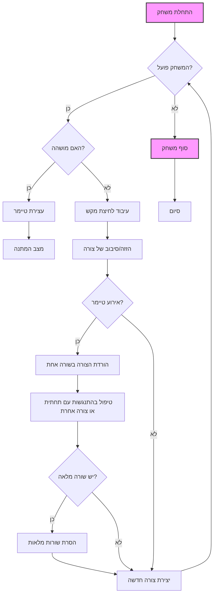

## משחק מס' 2: טטריס

### תיאור

משחק פאזל קלאסי שבו צורות (טטרומינו) נופלות מלמעלה, והשחקן נדרש לסובב ולהזיז אותן כדי ליצור שורות אופקיות שלמות.

### כללים

1.  טטרומינו נופלים מלמעלה אל שדה המשחק.
2.  השחקן יכול לסובב ולהזיז את הצורות הנופלות.
3.  כאשר שורה אופקית מתמלאת, היא נעלמת והשחקן מקבל נקודות.
4.  המשחק מסתיים אם צורות חדשות אינן יכולות להיכנס לשדה.

### קוד

```python
import sys, random
from PyQt5.QtWidgets import QMainWindow, QFrame, QDesktopWidget, QApplication
from PyQt5.QtCore import Qt, QBasicTimer, pyqtSignal
from PyQt5.QtGui import QPainter, QColor

class Tetris(QMainWindow):
    """
    החלון הראשי של יישום טטריס.
    """
    def __init__(self) -> None:
        """
        אתחול חלון טטריס.
        """
        super().__init__()
        self.initUI()

    def initUI(self) -> None:
        """
         אתחול ממשק המשתמש.
        """
        self.tboard = Board(self)
        self.setCentralWidget(self.tboard)
        self.statusbar = self.statusBar()
        self.tboard.msg2Statusbar[str].connect(self.statusbar.showMessage)
        self.tboard.start()
        self.resize(180, 380)
        self.center()
        self.setWindowTitle('Tetris')
        self.show()

    def center(self) -> None:
        """
        מרכז את החלון על המסך.
        """
        screen = QDesktopWidget().screenGeometry()
        size = self.geometry()
        self.move((screen.width() - size.width()) / 2, (screen.height() - size.height()) / 2)


class Board(QFrame):
    """
    מחלקה המייצגת את שדה המשחק של טטריס.
    """
    msg2Statusbar = pyqtSignal(str)
    BoardWidth = 10
    BoardHeight = 22
    Speed = 300

    def __init__(self, parent: QMainWindow) -> None:
        """
        אתחול שדה המשחק.
        
        Args:
            parent: חלון אב.
        """
        super().__init__(parent)
        self.initBoard()

    def initBoard(self) -> None:
         """
        מאתחל את הלוח ואת משתני המשחק.
        """
        self.timer = QBasicTimer()
        self.isWaitingAfterLine = False
        self.curX = 0
        self.curY = 0
        self.numLinesRemoved = 0
        self.board = []
        self.setFocusPolicy(Qt.StrongFocus)
        self.isStarted = False
        self.isPaused = False
        self.clearBoard()

    def shapeAt(self, x: int, y: int) -> int:
        """
        מחזיר את צורת הבלוק במיקום נתון.
        
        Args:
            x: קואורדינטת x.
            y: קואורדינטת y.
        Returns:
            צורת הטטרומינו במיקום.
        """
        return self.board[(y * Board.BoardWidth) + x]

    def setShapeAt(self, x: int, y: int, shape: int) -> None:
        """
        קובע את צורת הבלוק במיקום נתון.
        
        Args:
            x: קואורדינטת x.
            y: קואורדינטת y.
            shape: צורת הטטרומינו.
        """
        self.board[(y * Board.BoardWidth) + x] = shape

    def squareWidth(self) -> int:
         """
        מחזיר את רוחב ריבוע יחיד.
        
        Returns:
             רוחב הריבוע.
        """
        return self.contentsRect().width() // Board.BoardWidth

    def squareHeight(self) -> int:
        """
        מחזיר את גובה ריבוע יחיד.
         
        Returns:
             גובה הריבוע.
        """
        return self.contentsRect().height() // Board.BoardHeight

    def start(self) -> None:
         """
        מפעיל את המשחק.
        """
        if self.isPaused:
            return
        self.isStarted = True
        self.isWaitingAfterLine = False
        self.numLinesRemoved = 0
        self.clearBoard()
        self.msg2Statusbar.emit(str(self.numLinesRemoved))
        self.newPiece()
        self.timer.start(Board.Speed, self)

    def pause(self) -> None:
         """
        משהה את המשחק או מחדש אותו.
        """
        if not self.isStarted:
            return
        self.isPaused = not self.isPaused
        if self.isPaused:
            self.timer.stop()
            self.msg2Statusbar.emit("paused")
        else:
            self.timer.start(Board.Speed, self)
            self.msg2Statusbar.emit(str(self.numLinesRemoved))
        self.update()

    def paintEvent(self, event: object) -> None:
          """
         משרטט את שדה המשחק ואת הצורה הנוכחית.
         
         Args:
             event: אירוע שרטוט.
         """
        painter = QPainter(self)
        rect = self.contentsRect()
        boardTop = rect.bottom() - Board.BoardHeight * self.squareHeight()
        for i in range(Board.BoardHeight):
            for j in range(Board.BoardWidth):
                shape = self.shapeAt(j, Board.BoardHeight - i - 1)
                if shape != Tetrominoe.NoShape:
                    self.drawSquare(painter,
                        rect.left() + j * self.squareWidth(),
                        boardTop + i * self.squareHeight(), shape)
        if self.curPiece.shape() != Tetrominoe.NoShape:
            for i in range(4):
                x = self.curX + self.curPiece.x(i)
                y = self.curY - self.curPiece.y(i)
                self.drawSquare(painter, rect.left() + x * self.squareWidth(),
                    boardTop + (Board.BoardHeight - y - 1) * self.squareHeight(),
                    self.curPiece.shape())

    def keyPressEvent(self, event: object) -> None:
        """
        מטפל בלחיצות מקשים.
         
        Args:
             event: אירוע לחיצת מקש.
        """
        if not self.isStarted or self.curPiece.shape() == Tetrominoe.NoShape:
            super(Board, self).keyPressEvent(event)
            return
        key = event.key()
        if key == Qt.Key_P:
            self.pause()
            return
        if self.isPaused:
            return
        elif key == Qt.Key_Left:
            self.tryMove(self.curPiece, self.curX - 1, self.curY)
        elif key == Qt.Key_Right:
            self.tryMove(self.curPiece, self.curX + 1, self.curY)
        elif key == Qt.Key_Down:
            self.tryMove(self.curPiece.rotateRight(), self.curX, self.curY)
        elif key == Qt.Key_Up:
            self.tryMove(self.curPiece.rotateLeft(), self.curX, self.curY)
        elif key == Qt.Key_Space:
            self.dropDown()
        elif key == Qt.Key_D:
            self.oneLineDown()
        else:
            super(Board, self).keyPressEvent(event)

    def timerEvent(self, event: object) -> None:
          """
         מטפל באירועי טיימר.
         
         Args:
            event: אירוע טיימר.
        """
        if event.timerId() == self.timer.timerId():
            if self.isWaitingAfterLine:
                self.isWaitingAfterLine = False
                self.newPiece()
            else:
                self.oneLineDown()
        else:
            super(Board, self).timerEvent(event)

    def clearBoard(self) -> None:
        """
        מנקה את שדה המשחק.
        """
        for i in range(Board.BoardHeight * Board.BoardWidth):
            self.board.append(Tetrominoe.NoShape)

    def dropDown(self) -> None:
         """
        מוריד את הצורה הנוכחית עד למטה.
        """
        newY = self.curY
        while newY > 0:
            if not self.tryMove(self.curPiece, self.curX, newY - 1):
                break
            newY -= 1
        self.pieceDropped()

    def oneLineDown(self) -> None:
         """
        מוריד את הצורה הנוכחית בשורה אחת.
        """
        if not self.tryMove(self.curPiece, self.curX, self.curY - 1):
            self.pieceDropped()

    def pieceDropped(self) -> None:
        """
        מקבע את הצורה שנפלה על הלוח.
        """
        for i in range(4):
            x = self.curX + self.curPiece.x(i)
            y = self.curY - self.curPiece.y(i)
            self.setShapeAt(x, y, self.curPiece.shape())
        self.removeFullLines()
        if not self.isWaitingAfterLine:
            self.newPiece()

    def removeFullLines(self) -> None:
        """
        מסיר שורות מלאות ומעדכן את מונה הנקודות.
        """
        numFullLines = 0
        rowsToRemove = []
        for i in range(Board.BoardHeight):
            n = 0
            for j in range(Board.BoardWidth):
                if not self.shapeAt(j, i) == Tetrominoe.NoShape:
                    n = n + 1
            if n == 10:
                rowsToRemove.append(i)
        rowsToRemove.reverse()
        for m in rowsToRemove:
            for k in range(m, Board.BoardHeight):
                for l in range(Board.BoardWidth):
                        self.setShapeAt(l, k, self.shapeAt(l, k + 1))
        numFullLines = numFullLines + len(rowsToRemove)
        if numFullLines > 0:
            self.numLinesRemoved = self.numLinesRemoved + numFullLines
            self.msg2Statusbar.emit(str(self.numLinesRemoved))
            self.isWaitingAfterLine = True
            self.curPiece.setShape(Tetrominoe.NoShape)
            self.update()

    def newPiece(self) -> None:
         """
        מייצר צורה חדשה למשחק.
        """
        self.curPiece = Shape()
        self.curPiece.setRandomShape()
        self.curX = Board.BoardWidth // 2 + 1
        self.curY = Board.BoardHeight - 1 + self.curPiece.minY()
        if not self.tryMove(self.curPiece, self.curX, self.curY):
            self.curPiece.setShape(Tetrominoe.NoShape)
            self.timer.stop()
            self.isStarted = False
            self.msg2Statusbar.emit("Game over")

    def tryMove(self, newPiece: object, newX: int, newY: int) -> bool:
         """
        מנסה להזיז את הצורה לקואורדינטות חדשות.
        
        Args:
            newPiece: הצורה החדשה.
            newX: קואורדינטת X חדשה.
            newY: קואורדינטת Y חדשה.
        
        Returns:
            True אם ההזזה הצליחה, אחרת False.
        """
        for i in range(4):
            x = newX + newPiece.x(i)
            y = newY - newPiece.y(i)
            if x < 0 or x >= Board.BoardWidth or y < 0 or y >= Board.BoardHeight:
                return False
            if self.shapeAt(x, y) != Tetrominoe.NoShape:
                return False
        self.curPiece = newPiece
        self.curX = newX
        self.curY = newY
        self.update()
        return True

    def drawSquare(self, painter: QPainter, x: int, y: int, shape: int) -> None:
         """
        מצייר ריבוע על שדה המשחק.
        
         Args:
             painter: אובייקט QPainter.
             x: קואורדינטת x.
             y: קואורדינטת y.
             shape: צורת הטטרומינו.
        """
        colorTable = [0x000000, 0xCC6666, 0x66CC66, 0x6666CC,
                      0xCCCC66, 0xCC66CC, 0x66CCCC, 0xDAAA00]
        color = QColor(colorTable[shape])
        painter.fillRect(x + 1, y + 1, self.squareWidth() - 2,
            self.squareHeight() - 2, color)
        painter.setPen(color.lighter())
        painter.drawLine(x, y + self.squareHeight() - 1, x, y)
        painter.drawLine(x, y, x + self.squareWidth() - 1, y)
        painter.setPen(color.darker())
        painter.drawLine(x + 1, y + self.squareHeight() - 1,
            x + self.squareWidth() - 1, y + self.squareHeight() - 1)
        painter.drawLine(x + self.squareWidth() - 1,
            y + self.squareHeight() - 1, x + self.squareWidth() - 1, y + 1)


class Tetrominoe(object):
    """
    מנייה של כל צורות הטטרומינו האפשריות.
    """
    NoShape = 0
    ZShape = 1
    SShape = 2
    LineShape = 3
    TShape = 4
    SquareShape = 5
    LShape = 6
    MirroredLShape = 7

class Shape(object):
    """
    מחלקה המייצגת צורת טטרומינו.
    """
    coordsTable = (
        ((0, 0),     (0, 0),     (0, 0),     (0, 0)),
        ((0, -1),    (0, 0),     (-1, 0),    (-1, 1)),
        ((0, -1),    (0, 0),     (1, 0),     (1, 1)),
        ((0, -1),    (0, 0),     (0, 1),     (0, 2)),
        ((-1, 0),    (0, 0),     (1, 0),     (0, 1)),
        ((0, 0),     (1, 0),     (0, 1),     (1, 1)),
        ((-1, -1),   (0, -1),    (0, 0),     (0, 1)),
        ((1, -1),    (0, -1),    (0, 0),     (0, 1))
    )
    def __init__(self) -> None:
        """
         אתחול צורת טטרומינו.
        """
        self.coords = [[0, 0] for i in range(4)]
        self.pieceShape = Tetrominoe.NoShape
        self.setShape(Tetrominoe.NoShape)

    def shape(self) -> int:
        """
        מחזיר את צורת הבלוק.
        
        Returns:
             צורת הבלוק.
        """
        return self.pieceShape

    def setShape(self, shape: int) -> None:
        """
        קובע את צורת הבלוק.
        
        Args:
            shape: צורת הטטרומינו.
        """
        table = Shape.coordsTable[shape]
        for i in range(4):
            for j in range(2):
                self.coords[i][j] = table[i][j]
        self.pieceShape = shape

    def setRandomShape(self) -> None:
        """
        קובע צורה אקראית לבלוק.
        """
        self.setShape(random.randint(1, 7))

    def x(self, index: int) -> int:
         """
        מחזיר את קואורדינטת x עבור נקודה נתונה בבלוק.
        
        Args:
            index: אינדקס נקודה בבלוק.
        Returns:
            קואורדינטת x.
        """
        return self.coords[index][0]

    def y(self, index: int) -> int:
         """
        מחזיר את קואורדינטת y עבור נקודה נתונה בבלוק.
        
        Args:
            index: אינדקס נקודה בבלוק.
        Returns:
             קואורדינטת y.
        """
        return self.coords[index][1]

    def setX(self, index: int, x: int) -> None:
          """
         קובע את קואורדינטת x עבור נקודה נתונה בבלוק.
         
        Args:
             index: אינדקס נקודה בבלוק.
             x: קואורדינטת x חדשה.
        """
        self.coords[index][0] = x

    def setY(self, index: int, y: int) -> None:
         """
        קובע את קואורדינטת y עבור נקודה נתונה בבלוק.
        
        Args:
            index: אינדקס נקודה בבלוק.
            y: קואורדינטת y חדשה.
        """
        self.coords[index][1] = y

    def minX(self) -> int:
        """
         מחזיר את קואורדינטת ה-x המינימלית עבור הבלוק.
        
        Returns:
             קואורדינטת x מינימלית.
        """
        m = self.coords[0][0]
        for i in range(4):
            m = min(m, self.coords[i][0])
        return m

    def maxX(self) -> int:
          """
         מחזיר את קואורדינטת ה-x המקסימלית עבור הבלוק.
         
        Returns:
             קואורדינטת x מקסימלית.
        """
        m = self.coords[0][0]
        for i in range(4):
            m = max(m, self.coords[i][0])
        return m

    def minY(self) -> int:
         """
         מחזיר את קואורדינטת ה-y המינימלית עבור הבלוק.
        
         Returns:
             קואורדינטת y מינימלית.
        """
        m = self.coords[0][1]
        for i in range(4):
            m = min(m, self.coords[i][1])
        return m

    def maxY(self) -> int:
        """
        מחזיר את קואורדינטת ה-y המקסימלית עבור הבלוק.
       
        Returns:
             קואורדינטת y מקסימלית.
        """
        m = self.coords[0][1]
        for i in range(4):
            m = max(m, self.coords[i][1])
        return m

    def rotateLeft(self) -> object:
         """
        מסובב את הבלוק ב-90 מעלות שמאלה.
        
        Returns:
            בלוק חדש לאחר הסיבוב.
        """
        if self.pieceShape == Tetrominoe.SquareShape:
            return self
        result = Shape()
        result.pieceShape = self.pieceShape
        for i in range(4):
            result.setX(i, self.y(i))
            result.setY(i, -self.x(i))
        return result

    def rotateRight(self) -> object:
        """
        מסובב את הבלוק ב-90 מעלות ימינה.
        
        Returns:
            בלוק חדש לאחר הסיבוב.
        """
        if self.pieceShape == Tetrominoe.SquareShape:
            return self
        result = Shape()
        result.pieceShape = self.pieceShape
        for i in range(4):
            result.setX(i, -self.y(i))
            result.setY(i, self.x(i))
        return result

if __name__ == '__main__':
    app = QApplication([])
    tetris = Tetris()
    sys.exit(app.exec_())
```

### ניתוח קוד

*   **מחלקה `Tetris`:**
    *   יוצרת את החלון הראשי של היישום.
    *   `initUI()`: מאתחל את ממשק המשתמש, יוצר את שדה המשחק.
*   **מחלקה `Board`:**
    *   `initBoard()`: מאתחל את שדה המשחק, טיימר, וצורת המשחק הנוכחית.
    *   `start()`: מפעיל את המשחק, מייצר צורה חדשה.
    *   `pause()`: משהה את המשחק.
    *   `paintEvent()`: משרטט את שדה המשחק ואת הצורה הנופלת.
    *    `keyPressEvent()`: מטפל בלחיצות מקשים.
    *   `timerEvent()`: קורא למתודה `oneLineDown` באמצעות הטיימר.
    *   `clearBoard()`: מנקה את שדה המשחק.
    *   `dropDown()`: מוריד את הצורה עד למטה.
    *   `oneLineDown()`: מוריד את הצורה בשורה אחת.
    *   `pieceDropped()`: מקבע את הצורה על הלוח.
    *   `removeFullLines()`: מסיר שורות מלאות.
    *   `newPiece()`: יוצר צורה חדשה.
    *   `tryMove()`: מנסה להזיז את הצורה.
    *   `drawSquare()`: מצייר ריבוע יחיד.
*  **מחלקה `Tetrominoe`:**
    *   מגדירה את כל הצורות האפשריות.
*   **מחלקה `Shape`:**
    *   מייצגת צורת טטרומינו אחת.
    *   `setShape()`: קובע את צורת הבלוק.
    *   `setRandomShape()`: בוחר צורה אקראית.
    *   `x()`/`y()`: מחזיר את קואורדינטות הבלוק.
    *   `rotateLeft()`/`rotateRight()`: מסובב את הבלוק.

### תרשים זרימה
