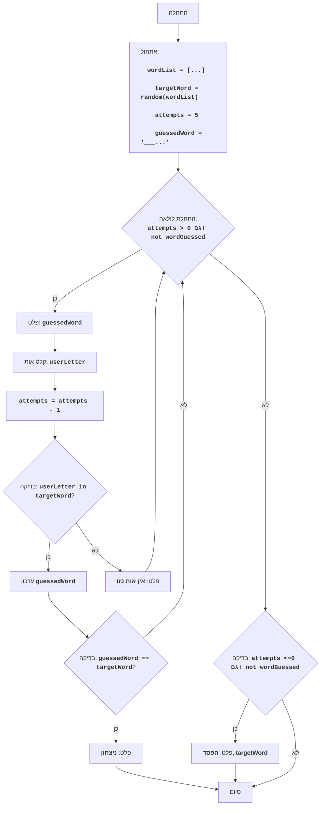

WORD:
=================
מורכבות: 5
-----------------
המשחק "WORD" הוא משחק ניחוש מילים. המחשב בוחר מילה אקראית מתוך רשימה מוגדרת מראש, והשחקן צריך לנחש אותה על ידי הזנת אותיות. לאחר כל ניסיון, המחשב מדווח האם האות שהוזנה קיימת במילה ובאיזו עמדה. השחקן צריך לנחש את המילה לפני שיכלה את כל הניסיונות העומדים לרשותו.

כללי המשחק:
1. המחשב בוחר מילה אקראית מתוך רשימה.
2. לשחקן ניתן מספר מוגדר של ניסיונות (ברירת מחדל 5).
3. השחקן מזין אות.
4. המחשב מדווח האם האות קיימת במילה, ואם כן, באילו עמדות.
5. השחקן מנסה לנחש את המילה על פי האותיות.
6. אם השחקן מנחש את המילה, המשחק מסתיים בניצחון.
7. אם השחקן מכלה את כל הניסיונות, המשחק מסתיים בהפסד.
-----------------
אלגוריתם:
1. אתחול:
    1.1. הגדרת רשימת מילים.
    1.2. בחירת מילה אקראית מתוך הרשימה.
    1.3. הגדרת מספר ניסיונות (ברירת מחדל 5).
    1.4. יצירת מחרוזת להצגת האותיות שניחשו (בתחילה כל העמדות הן "_").
2. התחל לולאה "כל עוד מספר הניסיונות גדול מ-0 והמילה לא נוחשה":
    2.1. הצגת המחרוזת עם האותיות שניחשו.
    2.2. בקשת קלט אות מהשחקן.
    2.3. הפחתת מספר הניסיונות ב-1.
    2.4. אם האות שהוזנה קיימת במילה שהוגרלה:
        2.4.1. החלף את "_" באות בעמדות המתאימות במחרוזת האותיות שניחשו.
        2.4.2. אם מחרוזת האותיות שניחשו שווה למילה שהוגרלה, הדפס הודעת ניצחון וצא מהלולאה.
    2.5. אם האות שהוזנה אינה קיימת במילה שהוגרלה, הדפס הודעה שהאות אינה קיימת.
3. אם לאחר הלולאה המילה לא נוחשה (נותרו ניסיונות והמילה לא נוחשה - למעשה תנאי זה מתייחס רק למקרה שהלולאה הסתיימה כי נגמרו הניסיונות), הדפס הודעת הפסד ואת המילה שהוגרלה.
4. סיום המשחק.
-----------------
תרשים זרימה:

מקרא:
    Start - התחלת התוכנית.
    InitializeVariables - אתחול משתנים: wordList (רשימת מילים), targetWord (המילה שהוגרלה נבחרת באקראי), attempts (מספר הניסיונות) מוגדר ל-5, guessedWord (מחרוזת עם האותיות שניחשו) מאותחל בסימני "_".
    LoopStart - התחלת הלולאה, הנמשכת כל עוד יש ניסיונות והמילה לא נוחשה.
    OutputGuessedWord - פלט מצב נוכחי של האותיות שניחשו.
    InputLetter - בקשת קלט אות מהמשתמש.
    DecreaseAttempts - הפחתת מספר הניסיונות שנותרו.
    CheckLetter - בדיקה האם האות שהוזנה קיימת במילה שהוגרלה.
    UpdateGuessedWord - עדכון מחרוזת האותיות שניחשו.
    CheckWin - בדיקה האם המילה נוחשה.
    OutputWin - פלט הודעה על ניצחון.
    OutputNoLetter - פלט הודעה שהאות שהוזנה אינה קיימת במילה.
    CheckLose - בדיקה האם נגמרו הניסיונות והמילה לא נוחשה.
    OutputLose - פלט הודעה על הפסד והמילה שהוגרלה.
    End - סיום התוכנית.
"""
```python
import random

# 1. אתחול
# 1.1 רשימת מילים למשחק
wordList = ["python", "java", "kotlin", "swift", "javascript", "go", "ruby"]
# 1.2 בחירת מילה אקראית
targetWord = random.choice(wordList)
# 1.3 מספר ניסיונות
attempts = 5
# 1.4 יצירת מחרוזת לאחסון אותיות שניחשו (לדוגמה, "_ _ _ _ _ _" עבור "python")
guessedWord = "_" * len(targetWord)

# 2. לולאת המשחק
while attempts > 0 and guessedWord != targetWord:
    # 2.1 פלט מצב נוכחי של האותיות שניחשו
    print("מילה:", guessedWord)
    # 2.2 בקשת קלט אות
    userLetter = input("הזן אות: ").lower()
    # 2.3 הפחתת מספר הניסיונות
    attempts -= 1

    # 2.4 בדיקה האם האות קיימת במילה שהוגרלה
    if userLetter in targetWord:
        # 2.4.1 עדכון המחרוזת עם האותיות שניחשו
        for i in range(len(targetWord)):
            if targetWord[i] == userLetter:
                guessedWord = guessedWord[:i] + userLetter + guessedWord[i+1:]

        # 2.4.2 בדיקה האם המילה נוחשה
        if guessedWord == targetWord:
            print("ברכות! ניחשת את המילה:", targetWord)
            break
    else:
        # 2.5 מודיעים שהאות לא קיימת
        print("אות כזו אינה קיימת במילה.")

# 3. בדיקת הפסד
if guessedWord != targetWord:
    print("הפסדת. המילה שהוגרלה הייתה:", targetWord)

```
**הסבר הקוד**:
1.  **ייבוא מודול `random`**:
    -   `import random`: מייבא את מודול random לבחירת מילה אקראית.

2.  **אתחול**:
    -   `wordList = ["python", "java", "kotlin", "swift", "javascript", "go", "ruby"]`: יוצר רשימת מילים, שממנה תיבחר המילה לניחוש.
    -   `targetWord = random.choice(wordList)`: בוחר מילה אקראית מתוך הרשימה `wordList` ושומר אותה ב-`targetWord`. זו המילה שהשחקן צריך לנחש.
    -   `attempts = 5`: קובע את מספר הניסיונות העומדים לרשות השחקן.
    -   `guessedWord = "_" * len(targetWord)`: יוצר מחרוזת `guessedWord` שמורכבת בתחילה מסימני "_". מספר ה-"_" תואם לאורך המילה שהוגרלה. מחרוזת זו מציגה את התקדמות ניחוש המילה על ידי השחקן.

3.  **לולאת המשחק `while attempts > 0 and guessedWord != targetWord:`**:
    -   `while attempts > 0 and guessedWord != targetWord:`: הלולאה ממשיכה כל עוד לשחקן יש ניסיונות (`attempts > 0`) ועדיין לא ניחש את המילה (`guessedWord != targetWord`).
    -   `print("מילה:", guessedWord)`: מציג את המצב הנוכחי של המילה המנוחשת (לדוגמה, "_ _ t _ o _").
    -   `userLetter = input("הזן אות: ").lower()`: מבקש קלט אות מהשחקן וממיר אותה לאות קטנה.
    -   `attempts -= 1`: מקטין את מספר הניסיונות הזמינים ב-1.

4. **בדיקת אות ועדכון `guessedWord`**:
   - `if userLetter in targetWord:`: בודק האם האות שהוזנה קיימת במילה שהוגרלה.
    -  אם האות קיימת:
       -  `for i in range(len(targetWord)):`: לולאה העוברת על כל אינדקסי התווים של המילה שהוגרלה.
          - `if targetWord[i] == userLetter:`: אם האות במילה שהוגרלה תואמת לאות שהוזנה, אז:
              - `guessedWord = guessedWord[:i] + userLetter + guessedWord[i+1:]`: מחליף את הסימן "_" באות המנוחשת במחרוזת `guessedWord` בעמדה המתאימה.
       - `if guessedWord == targetWord:`: בודק האם המילה נוחשה במלואה.
          - `print("ברכות! ניחשת את המילה:", targetWord)`: מציג הודעת ברכה על ניחוש המילה.
          - `break`: מסיים את לולאת המשחק.
   -  `else:`: אם האות שהוזנה אינה קיימת במילה שהוגרלה.
       -  `print("אות כזו אינה קיימת במילה.")`: מציג הודעה על כך שהאות שהוזנה אינה קיימת במילה.

5. **בדיקת הפסד**:
   -  `if guessedWord != targetWord:`: לאחר סיום הלולאה בודק האם המילה לא נוחשה.
       -  `print("הפסדת. המילה שהוגרלה הייתה:", targetWord)`: מציג הודעה על הפסד ומראה את המילה שהוגרלה.

       ----------
- קובץ הקוד [ACEDU](https://github.com/hypo69/hypo/blob/master/src/endpoints/ai_games/101_basic_computer_games/ru/AMAZING/amazing.py)
- הפעלת הקוד ב-Google Colab: [ACEDU](https://colab.research.google.com/drive/1aG11rVe2m7_0pdz1fmLhHGwmUH02eWhs?usp=sharing)
- [חזרה לרשימת המשחקים](https://github.com/hypo69/hypo/blob/master/src/endpoints/ai_games/101_basic_computer_games/ru)