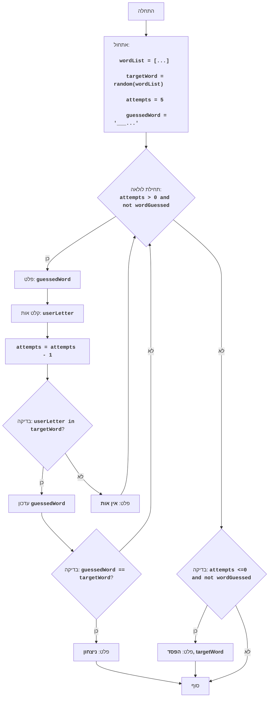

WORD:
=================
מורכבות: 5
-----------------
המשחק "WORD" הוא משחק ניחוש מילים. המחשב בוחר מילה אקראית מתוך רשימה מוגדרת מראש, והשחקן נדרש לנחש אותה על ידי הזנת אותיות. לאחר כל ניסיון, המחשב מודיע האם האות שהוזנה קיימת במילה ובאילו עמדות. השחקן נדרש לנחש את המילה לפני שיאזלו כל ניסיונותיו.

כללי המשחק:
1. המחשב בוחר מילה אקראית מתוך רשימה.
2. לשחקן מוקצית כמות מוגדרת של ניסיונות (ברירת מחדל: 5).
3. השחקן מזין אות.
4. המחשב מודיע האם האות קיימת במילה, ואם כן, באילו עמדות.
5. השחקן מנסה לנחש את המילה על פי האותיות.
6. אם השחקן מנחש את המילה, המשחק מסתיים בניצחון.
7. אם השחקן מאזל את כל ניסיונותיו, המשחק מסתיים בהפסד.
-----------------
אלגוריתם:
1. אתחול:
    1.1. הגדרת רשימת מילים.
    1.2. בחירת מילה אקראית מהרשימה.
    1.3. הגדרת מספר הניסיונות (ברירת מחדל: 5).
    1.4. יצירת מחרוזת להצגת האותיות שנוחשו (בתחילה כל העמדות מסומנות ב-'_').
2. תחילת לולאה "כל עוד מספר הניסיונות גדול מ-0 והמילה לא נוחשה":
    2.1. הצגת המחרוזת עם האותיות שנוחשו.
    2.2. בקשת קלט אות מהשחקן.
    2.3. הפחתת מספר הניסיונות ב-1.
    2.4. אם האות שהוזנה קיימת במילה המנוחשת:
        2.4.1.  החלפת הסמל '_' באות בעמדות המתאימות במחרוזת האותיות שנוחשו.
        2.4.2. אם מחרוזת האותיות שנוחשו שווה למילה המנוחשת, אז להציג הודעת ניצחון ולצאת מהלולאה.
    2.5. אם האות שהוזנה אינה קיימת במילה המנוחשת, אז להציג הודעה על כך שאין אות כזו.
3. אם לאחר הלולאה המילה לא נוחשה (נותרו ניסיונות והמילה לא נוחשה), אז להציג הודעה על הפסד ואת המילה המנוחשת.
4. סוף המשחק.
-----------------
תרשים זרימה:

מקרא:
    Start - תחילת התוכנית.
    InitializeVariables - אתחול משתנים: wordList (רשימת מילים), targetWord (המילה המנוחשת נבחרת באקראי), attempts (מספר הניסיונות) מוגדר ל-5, guessedWord (מחרוזת האותיות שנוחשו) מאותחלת בסימנים '_'.
    LoopStart - תחילת הלולאה, הנמשכת כל עוד יש ניסיונות והמילה לא נוחשה.
    OutputGuessedWord - פלט המצב הנוכחי של האותיות שנוחשו.
    InputLetter - בקשת קלט אות מהמשתמש.
    DecreaseAttempts - הפחתת מספר הניסיונות הנותרים.
    CheckLetter - בדיקה האם האות שהוזנה קיימת במילה המנוחשת.
    UpdateGuessedWord - עדכון מחרוזת האותיות שנוחשו.
    CheckWin - בדיקה האם המילה נוחשה.
    OutputWin - פלט הודעת ניצחון.
    OutputNoLetter - פלט הודעה על כך שהאות שהוזנה אינה קיימת במילה.
    CheckLose - בדיקה האם אזלו הניסיונות והמילה לא נוחשה.
    OutputLose - פלט הודעה על הפסד והמילה המנוחשת.
    End - סוף התוכנית.
"""
```python
import random

# 1. אתחול
# 1.1 רשימת מילים למשחק
wordList = ["python", "java", "kotlin", "swift", "javascript", "go", "ruby"]
# 1.2 בחירת מילה אקראית
targetWord = random.choice(wordList)
# 1.3 מספר ניסיונות
attempts = 5
# 1.4 יצירת מחרוזת לאחסון האותיות שנוחשו (לדוגמה, "_ _ _ _ _ _" עבור "python")
guessedWord = "_" * len(targetWord)

# 2. לולאת המשחק
while attempts > 0 and guessedWord != targetWord:
    # 2.1 הצגת המצב הנוכחי של האותיות שנוחשו
    print("Слово:", guessedWord)
    # 2.2 בקשת קלט אות
    userLetter = input("Введите букву: ").lower()
    # 2.3 הפחתת מספר הניסיונות
    attempts -= 1

    # 2.4 בדיקה האם האות קיימת במילה המנוחשת
    if userLetter in targetWord:
        # 2.4.1 עדכון המחרוזת עם האותיות שנוחשו
        for i in range(len(targetWord)):
            if targetWord[i] == userLetter:
                guessedWord = guessedWord[:i] + userLetter + guessedWord[i+1:]

        # 2.4.2 בדיקה האם המילה נוחשה
        if guessedWord == targetWord:
            print("ברכות! ניחשת את המילה:", targetWord)
            break
    else:
        # 2.5 הודעה על כך שהאות אינה קיימת
        print("אות כזו אינה קיימת במילה.")

# 3. בדיקה למקרה של הפסד
if guessedWord != targetWord:
    print("הפסדת. המילה המנוחשת הייתה:", targetWord)

```
**הסבר על הקוד**:
1.  **ייבוא מודול `random`**:
    -   `import random`: מייבא את מודול random לבחירת מילה אקראית.

2.  **אתחול**:
    -   `wordList = ["python", "java", "kotlin", "swift", "javascript", "go", "ruby"]`: יוצר רשימת מילים שממנה תיבחר המילה המנוחשת.
    -   `targetWord = random.choice(wordList)`: בוחר מילה אקראית מתוך הרשימה `wordList` ושומר אותה ב-`targetWord`. זו המילה שהשחקן נדרש לנחש.
    -   `attempts = 5`: מגדיר את מספר הניסיונות הזמינים לשחקן.
    -   `guessedWord = "_" * len(targetWord)`: יוצר מחרוזת `guessedWord` המורכבת בתחילה מסימנים '_'. מספר ה-'_' תואם לאורך המילה המנוחשת. מחרוזת זו מציגה את התקדמות השחקן בניחוש המילה.

3.  **לולאת המשחק `while attempts > 0 and guessedWord != targetWord:`**:
    -   `while attempts > 0 and guessedWord != targetWord:`: הלולאה נמשכת כל עוד לשחקן יש ניסיונות (`attempts > 0`) והמילה טרם נוחשה (`guessedWord != targetWord`).
    -   `print("Слово:", guessedWord)`: מציג את המצב הנוכחי של המילה שניחשו (לדוגמה, "_ _ t _ o _").
    -   `userLetter = input("Введите букву: ").lower()`: מבקש קלט אות מהשחקן וממיר אותה לאות קטנה.
    -   `attempts -= 1`: מפחית את מספר הניסיונות הזמינים ב-1.

4. **בדיקת האות ועדכון `guessedWord`**:
   - `if userLetter in targetWord:`: בודק האם האות שהוזנה קיימת במילה המנוחשת.
    -  אם האות קיימת:
       -  `for i in range(len(targetWord)):`: הלולאה עוברת על כל האינדקסים של תווי המילה המנוחשת.
          - `if targetWord[i] == userLetter:`: אם האות במילה המנוחשת תואמת לאות שהוזנה, אז:
              - `guessedWord = guessedWord[:i] + userLetter + guessedWord[i+1:]`: מחליף את הסימן '_' באות שנוחשה במחרוזת `guessedWord` בעמדה המתאימה.
       - `if guessedWord == targetWord:`: בודק האם המילה נוחשה במלואה.
          - `print("ברכות! ניחשת את המילה:", targetWord)`: מציג ברכה על ניחוש המילה.
          - `break`: מסיים את לולאת המשחק.
   -  `else:`: אם האות שהוזנה אינה קיימת במילה המנוחשת.
       -  `print("אות כזו אינה קיימת במילה.")`: מציג הודעה על כך שהאות שהוזנה אינה קיימת במילה.

5. **בדיקת הפסד**:
   -  `if guessedWord != targetWord:`: לאחר סיום הלולאה בודק האם המילה לא נוחשה.
       -  `print("הפסדת. המילה המנוחשת הייתה:", targetWord)`: מציג הודעה על הפסד ומראה את המילה המנוחשת.

       ----------
- קובץ הקוד [ACEDU](https://github.com/hypo69/hypo/blob/master/src/endpoints/ai_games/101_basic_computer_games/ru/AMAZING/amazing.py)
- הרצת הקוד ב-Google Colab: [ACEDU](https://colab.research.google.com/drive/1aG11rVe2m7_0pdz1fmLhHGwmUH02eWhs?usp=sharing)
- [חזרה לרשימת המשחקים](https://github.com/hypo69/hypo/blob/master/src/endpoints/ai_games/101_basic_computer_games/ru)